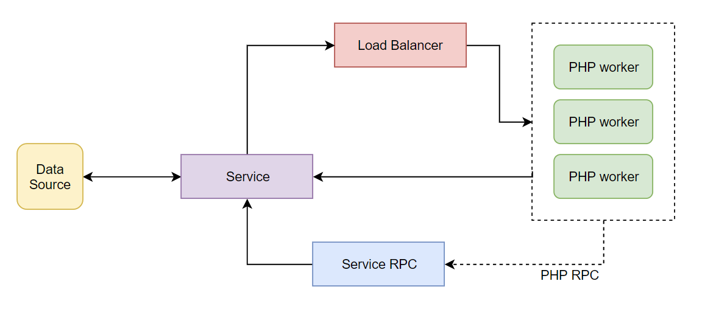

Тестовое задание на позицию Senior/Lead PHP Developer – TheSoul Publishing
==========================================================================

Микросервис проверки валидности паспортов
=========================================

План работы:
------------

1. Сбор требований к ПО.
2. Планирование разработки (например, для методологии SCRUM - составляем бэклог, определяем задачи, оцениваем трудозатраты,
формируем итерации. Задачи составляем на основе нижеизложенных пунктов).
3. Проектирование архитектуры микросервиса (на основе требований).
4. Проектирование архитектуры данных
5. Проектирование инфраструктуры для запуска микросервиса (на основе требований, например, облачная платформа).
6. Проектирование поставки сервиса из окружения разработки / staging в production инфраструктуру (на основе требований).
7. Проектирование инфраструктуры QA и мониторинга QoS микросервиса.
-
8. Разработка структуры данных.
9. Разработка кода микросервиса.
10. Разработка приемочных / функциональных тестов.
11. Настройка деплоймента.
12. Настройка мониторинга.

Сбор требований к ПО
--------------------

Первоначальные требования:
1. время ответа на запрос 1ms,
2. uptime 99%.

Дополнительные:
1. Требования к инфраструктуре (например, облачная платформа или standalone-сервер и т.д.)
2. Какие NOSQL решения применяются в текущей инфраструктуре компании? (может быть важным на этапе проектирования
архитектуры данных)
3. Какие инструменты мониторинга приложений и сервисов применяются в текущей инфраструктуре компании? (важно на этапе 
проектирования мониторинга сервиса)

Планирование разработки
-----------------------

1. Переносим необходимые части из этого плана в виде задач в бэклог
2. Проводим общий груминг бэклога: декомпозиция крупных задач, уточнение требований, детализация описания, приоретизация.
3. Оцениваем необходимый и достаточный размер команды для проекта (ориентировочно - 1 разработчик full-time / part-time).
4. Оценка трудозатрат по задачам.
5. Формирование спринтов (итераций). Можно предположить, что данный проект оптимально разделить на две недельных итерации.
Уточнить по оценке трудозатрат.

Проектирование архитектуры микросервиса
---------------------------------------

Исходя из требований к микросервису и природы источника данных предлагаю следующую архитектуру решения:

1. API сервис, задача которого - получать запросы через REST, осуществлять поиск в БД и возвращать результат.
По конкретике слоя хранения данных в БД - см. следующий раздел.

Язык реализации - PHP 7.2+. Для запуска использовать высокопроизводительный сервер PHP-приложений RoadRunner - 
https://github.com/spiral/roadrunner. Его особенность - запуск PHP-приложения внутри go-рутин и балансировка нагрузки
между ними; внутри каждого экземпляра приложения PHP (worker) запросы обрабатываются в цикле, что предотвращает 
необходимость инициализации PHP-приложения при каждом запросе (см. ). 
Это позволит нам обрабатывать запросы максимально быстро. 

2. Обновление данных с помощью периодически запускаемого воркера (скрипта), который проверяет сайт ГУМВД на наличие
обновленной базы, в случае обновления - скачивает и обновляет БД.

Проектирование архитектуры данных
---------------------------------

Изучение данных говорит нам о том, что они представляют собой редко изменяемый список из примерно 126+ миллионов записей
(серия и номер паспорта). Основные операции, которые должен выполнять сервис с этими данными:

1. Поиск на наличие в списке по точному совпадению.
2. Изменение списка (дополнение) - редко (заявлено ежедневное обновление).

Очевидно, что такая природа данных приводит нас к следующему решению:

1. Данные должны быть организованы в хэш-таблице, обращение к которой по ключу имеет временную сложность O(1) (в отличие
от обычного для реляционных баз использования индекса на основе B-дерева). 
2. Нецелесообразно на такой простой структуре данных использовать сложную инфраструктуру данных, наподобие SQL СУБД.
Наиболее оптимальным (в рамках данного тестового задания) представляется использование Redis. Однако на практике в 
действующей инфраструктуре компании может быть более предпочтительным использовать иное NOSQL решение, которое уже 
применено в других проектах - чтобы не плодить "зоопарк" решений.
3. Следует учесть, что перестроение хэш-таблицы с её ростом требует большего количества времени. Однако у нас данные
изменяются не так часто, поэтому здесь это не проблема.
4. Конкретно для Redis - использовать множественные хэш-таблицы (HSET) с распределением по ключу. Получаем ~2 Gb RAM
при 150 млн записей (см. [пример оценки](./test/redis-test.py)).

Проектирование инфраструктуры для запуска микросервиса
------------------------------------------------------

1. Выполняется на основе требований к инфраструктуре (См. сбор требований)
2. Требование к uptime 99% (7,3 часа downtime в месяц) предполагает соотв. надёжность инфраструктуры. Например, при
использовании инфраструктуры AWS тут возможно организовать hot spare instance, который бы подменял основной инстанс
в случае падения, при этом следует учесть то, что БД на hot spare должна обновлятся одновременно с основной (см. 
предыдущий раздел). Возможны и другие решения, что зависит от п.1.

Проектирование поставки сервиса из окружения разработки / staging в production инфраструктуру (на основе требований)
--------------------------------------------------------------------------------------------------------------------

У нас должны быть определены требования к тому, как мы выполняем поставку микросервиса в рабочую (production) 
инфраструктуру. Например, мы можем применять единый для всех наших проектов WorkFlow основанный на Continious Delivery /
Continious Integration. В этом случае мы используем специализированный CI-сервер, например Jenkins, в котором мы 
настраиваем необходимую для проекта сборку на серверах тестирования / staging и на production. В дальнейшем поставка
production-ready кода в production инфраструктуру может выполнятся сразу же после слияния с основной веткой кода,
тестовые сервера обновлятся автоматически.

Проектирование инфраструктуры QA и мониторинга QoS микросервиса
---------------------------------------------------------------

1. Предлагается описание исполняемых спецификаций на языке Gherkin для приёмочного тестирования микросервиса через REST
интерфейс (см. [passport.feature](features/passport.feature)). 

2. Предлагается использовать сервис мониторинга NewRelic для контроля за состоянием "жизни" микросервиса, числом
обрабатываемых им запросов и соответствием uptime и времени обработки запроса заданным требованиям к ПО. В том случае,
если для подобных задач в общей инфраструктуре компании применено другое решение - разумно использовать именно его.

